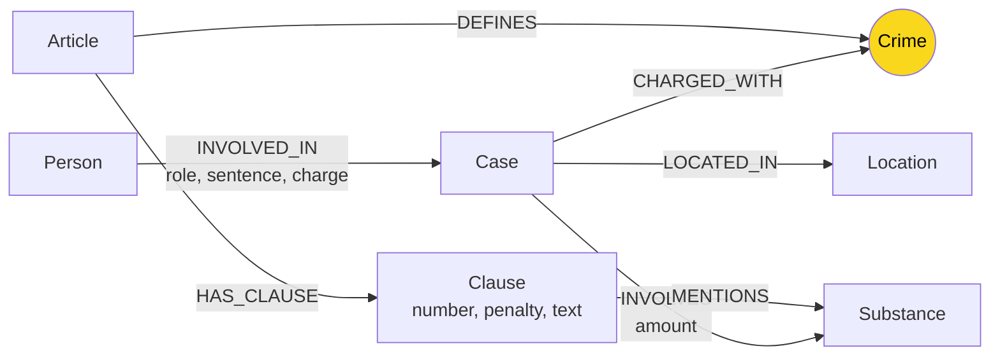

# Thiết kế Ontology — Day 19

**Họ tên:** Trần Hữu Đức  **MSSV:** 2A202602459

**Lựa chọn** (đánh dấu một):
- [x] Dùng ontology gợi ý (có thể chỉnh nhỏ)
- [ ] Tự thiết kế (xét bonus +15, xem `SUBMISSION.md`)

> Dùng ontology gợi ý trong `src/graph.py` vì cầu nối `Crime` đã đủ để nối 2 KB luật–tin và pass `--check`. Mọi label/quan hệ dưới đây khớp 1-1 với `suggested_constraints`, `add_law_article`, `add_news_case`.

## 1. Sơ đồ

Node cầu nối là `Crime` (vàng).

## 2. Entity types (node labels)

| Label | Ý nghĩa | Khóa định danh (`MERGE` theo) | Properties | Lấy từ KB nào | Trích bằng (regex / LLM / khác) |
| --- | --- | --- | --- | --- | --- |
| `Article` | Một Điều luật (VD Điều 251 BLHS) | `id` (VD `Điều 251 BLHS`) | `id, title, law, doc_id` | luật | regex (`parse_law_article`, metadata `article`) |
| `Clause` | Khoản trong Điều (khung hình phạt) | `id` (VD `Điều 251 BLHS khoản 1`) | `id, number, penalty, text, doc_id` | luật | regex (`CLAUSE_START`, `penalty` regex) |
| `Crime` | Tội danh chuẩn (node cầu nối, dùng chung) | `name` (đã chuẩn hóa, VD `mua bán trái phép chất ma túy`) | `name` (không `doc_id`) | cả hai | luật: từ tiêu đề Điều; tin: LLM + `link_entity` |
| `Case` | Vụ án cụ thể trong 1 bài báo | `name` (LLM đặt, fallback = title bài) | `name, summary, date, doc_id, source_title` | tin | LLM (`extract_news_cases`) |
| `Person` | Người trong vụ (bị cáo/bị can/nghi phạm) | `name` | `name, aliases, doc_id` (qua cạnh, không trực tiếp? thực tế Person không set doc_id — xem mục 6) | tin | LLM |
| `Substance` | Chất ma túy (Heroine, MDMA, cần sa…) | `name` | `name` (không `doc_id`, dùng chung) | cả hai | luật: `find_substances`; tin: LLM + danh sách chuẩn |
| `Location` | Tỉnh/thành nơi xảy ra vụ | `name` | `name` (không `doc_id`) | tin | LLM |

Tổng với full KB: `Article`=18, `Crime`=13 (cố định từ luật), còn lại phụ thuộc LLM.

## 3. Relationships

| Type | Từ → Đến | Properties trên cạnh | Ý nghĩa |
| --- | --- | --- | --- |
| `DEFINES` | `Article → Crime` | — | Điều luật định nghĩa tội danh đó |
| `HAS_CLAUSE` | `Article → Clause` | — | Điều gồm các khoản |
| `MENTIONS` | `Clause → Substance` | — | Khoản nhắc tới chất (ngưỡng khối lượng nằm trong `Clause.text`) |
| `CHARGED_WITH` | `Case → Crime` | — | Vụ bị truy tố/xét xử về tội đó (cạnh cầu nối) |
| `INVOLVES` | `Case → Substance` | `amount` (VD `hơn 9,6kg`) | Vụ liên quan chất + khối lượng thu giữ |
| `LOCATED_IN` | `Case → Location` | — | Vụ xảy ra ở đâu |
| `INVOLVED_IN` | `Person → Case` | `role, sentence, charge` (VD `bị cáo, 36 tháng tù, mua bán…`) | Người tham gia vụ với vai trò/án/tội |

Hướng cạnh: từ cụ thể → trừu tượng/chung (`Case→Crime`, `Article→Crime`) để đi 2 chiều qua `Crime`.

## 4. Node cầu nối giữa 2 KB

- **Node nào:** `Crime` (VD `mua bán trái phép chất ma túy`, `vận chuyển trái phép chất ma túy`, `tổ chức sử dụng trái phép chất ma túy`).
- **Vì sao chọn node này:** cả 2 KB đều nói về “tội gì” bằng cùng từ vựng luật hình sự. Luật: tiêu đề Điều (`Tội …`) → `DEFINES`. Tin: báo ghi tội danh bị cáo → `CHARGED_WITH`. `shortestPath ≤4` luật–tin luôn qua `Crime`: `(luật:Clause)<-[:HAS_CLAUSE]-(Article)-[:DEFINES]->(Crime)<-[:CHARGED_WITH]-(Case)`.
- **Cách đảm bảo hai phía khớp tên:** `normalize_crime` (thường hoá chữ hoa, prefix `Tội `, khoảng trắng) + `link_entity` (exact sau normalize, fallback `difflib.get_close_matches cutoff=0.8`, giữ nguyên spelling trong `known`, `None` nếu không đủ giống). Prompt LLM được nhồi `DANH SÁCH TỘI DANH` chuẩn từ luật rồi vẫn filter lại bằng `link_entity` trong code.
- **Khi nào cầu gãy, và bạn xử lý thế nào:** gãy khi (1) LLM trả tội không trong list và `link_entity→None` → `Case` không có `CHARGED_WITH`; (2) biến thể chính tả quá xa (cutoff 0.8 không bắt); (3) bài báo không phải vụ án (`cases: []`). Xử lý: không đoán bừa (thà mất cạnh còn hơn nối sai); `--check` phát hiện bằng `shortestPath`; KG-3 vẫn trả `seed_facts` 1-hop nên không trắng tay.

## 5. Competency questions

| Câu | Đường đi (Cypher pattern) | Trả lời được? |
| --- | --- | --- |
| Q1 single-hop-law (tiền chất là gì?) | `(:Article {id CONTAINS 'PCMT'})-[:HAS_CLAUSE]->(:Clause)` + vector chunk luật | Được (không cần cầu; vector + clause text đủ) |
| Q2 single-hop-news (ai tử hình vụ 36kg?) | `(:Person)-[:INVOLVED_IN {sentence:'tử hình'}]->(:Case)` + summary | Được |
| Q3 cross-kb (Lê Minh Thành: án? tội? Điều? khung?) | `(:Person {name:'Lê Minh Thành'})-[:INVOLVED_IN]->(:Case)-[:CHARGED_WITH]->(:Crime)<-[:DEFINES]-(:Article)-[:HAS_CLAUSE]->(:Clause {number:1})` | Được — đường chuẩn KG-3 |
| Q4 cross-kb (Hoàng Nato: hành vi? tối đa?) | `(:Person)-[:INVOLVED_IN]->(:Case {INVOLVES MDMA/…})-[:CHARGED_WITH]->(:Crime)<-[:DEFINES]-(:Article {Điều 255})-[:HAS_CLAUSE]->(:Clause)` cần khoản 4 (chung thân) → KG-3 chỉ giữ khoản 1 + khoản MENTIONS chất vụ đó; nếu vụ thiếu `INVOLVES` thì hụt khoản nặng | Được một phần (xem E2) |
| Q5 cross-kb-multi-hop (Cái Quang Huy: tội? MDMA bao nhiêu? khoản nào?) | `(:Case)-[:INVOLVES {amount:'9,6kg MDMA'}]->(:Substance {MDMA})`, `(:Case)-[:CHARGED_WITH]->(:Crime)<-[:DEFINES]-(:Article {Điều 250})-[:HAS_CLAUSE {number:4}]->(:Clause MENTIONS MDMA)` | Được nếu `INVOLVES/MENTIONS` đủ; ngưỡng `100g trở lên → khoản 4` nằm trong `Clause.text`, không tách thành property nên phải đọc text |
| Q6 aggregation (vụ nào liên quan MDMA?) | `(:Case)-[:INVOLVES]->(:Substance {name:'MDMA'})` liệt kê nhiều Case | Được (graph liệt kê chính xác hơn vector top-k=3) |

## 6. Quyết định thiết kế và đánh đổi

1. **Mức án là property trên cạnh `INVOLVED_IN {sentence}`, không phải node.** Phương án khác: node `Sentence` riêng. Chọn property vì mỗi án gắn chặt với (người, vụ) và câu hỏi chỉ cần đọc chuỗi (`36 tháng tù`); tách node gây phình graph mà không thêm đường đi. Đánh đổi: khó aggregate (`ai bị án nặng nhất?` phải parse string).
2. **Luật trích bằng regex, tin bằng LLM.** Phương án khác: LLM hết. Chọn regex cho luật vì văn bản đều (`1. … thì bị phạt…`, `a) … Heroine … gam`), rẻ/ổn định/không tốn token; LLM cho tin vì văn xuôi tự do. Đánh đổi: regex giòn nếu format Điều khác (PCMT Chương I không có `Tội ` → `crime=None`).
3. **`Case/Person` MERGE theo `name` do LLM đặt (không có ID ổn định).** Phương án khác: `MERGE theo (name + doc_id)` hoặc ID nhân tạo. Chọn `name` để cùng vụ qua 2 bài có cơ hội gộp, đúng gợi ý. Đánh đổi: dễ trùng (2 vụ khác tên giống nhau) hoặc tách đôi (1 vụ 2 tên) → E3. `doc_id` vẫn set trên `Case` nên truy vết được nguồn; `Person/Substance/Location/Crime` dùng chung nên không có `doc_id` (hợp lệ theo `--build`).
4. **Ngưỡng khối lượng để trong `Clause.text`, không mô hình hoá.** Phương án khác: node `Threshold {substance, min_g, max_g, clause}`. Chọn text vì đơn giản, đủ cho Q3/Q4 (khung cơ bản); Q5 cần suy luận ngưỡng → LLM đọc text. Đánh đổi: không query số học được (`MDMA 9,6kg → khoản 4` phải nhờ LLM).

## 7. So với ontology gợi ý (bắt buộc nếu xét bonus)

Không xét bonus — dùng nguyên ontology gợi ý, chỉ chỉnh nhỏ (dedupe `doc_ids`, `collect(subs)` khi lọc khoản theo Điều nêu trong câu hỏi).

| Điểm khác | Gợi ý làm gì | Bạn làm gì | Vấn đề nó giải quyết | Bằng chứng (Cypher, hoặc số liệu benchmark) |
| --- | --- | --- | --- | --- |
| — | — | — | — | — |

## 8. Hạn chế còn lại

- `Substance` không gộp đồng nghĩa (`cần sa` vs `cannabis`, `kẹo` vs `MDMA`): `MERGE` theo tên thô → trùng (E3).
- Không tách giai đoạn tố tụng (bắt/khởi tố/xét xử/phúc thẩm): `INVOLVED_IN.role` trộn `bị cáo/bị can/nghi phạm`, án sơ thẩm/phúc thẩm lẫn.
- `Case` trùng tên do LLM đặt tự do; `Person` thiếu chuẩn hoá tên/biệt danh.
- KG-3 chỉ lấy khoản 1 + khoản MENTIONS chất của vụ → hụt khoản nặng nếu `INVOLVES` thiếu (E2).
